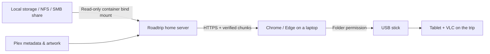

# Roadtrip

**Let the family pick the movies. Pack the USB stick from your browser.**

[](https://github.com/CrazyLegsFE/roadtrip-library/actions/workflows/ci.yml)

Roadtrip is a self-hosted companion to Plex for preparing an offline movie collection before a trip. Everyone browses the library, adds their picks, and requests missing titles. When it's time to pack, plug a USB stick into a laptop or desktop and sync the trip list through the website.

Your movie server can stay in the rack. Use VLC or another offline player on the tablet in the car.

> **Early release:** intended for a trusted home network. Direct USB syncing targets current desktop Chrome and Edge over trusted HTTPS. Check browser permissions and physical USB behavior on your equipment before preparing a full trip. See [validation](VALIDATION.md).

## Features

| Plan together | Prepare the drive |
|---|---|
| Plex posters, descriptions, genres, runtimes and file sizes | Copy from the home server to a browser-selected USB folder |
| Shared trip list with family names on picks | SHA-256 verification and saved resume checkpoints |
| Select smaller or higher-resolution file versions | Verify and reuse matching movies already on the stick |
| Wishlist for movies outside the library | Keep the screen awake while transferring, where supported |
| View the last-known catalog of an unplugged drive | Pause/retry and explicitly remove individual USB copies |

No companion application, paid metadata API, JavaScript dependency installation, or USB connection to the server is required.

## Dependencies and optional GPU support

The base app needs Docker Engine with the Compose plugin, access to your Plex server and media folders, and trusted HTTPS for desktop Chrome/Edge USB transfers. **A GPU is not required.** Browsing, trip lists, wishlist, original-file copying, verification, and optional SSD staging work without transcoding dependencies.

| Mode | Additional requirements | Compose files |
|---|---|---|
| Copy originals | None; no FFmpeg or GPU needed | `compose.yaml` |
| CPU transcoding (including Intel and AMD CPUs) | Optional transcoding image, which includes FFmpeg; writable server cache space | `compose.yaml` + `compose.transcode.yaml` |
| NVIDIA GPU transcoding | Transcoding image, an H.264 NVENC-capable GPU, compatible host driver, and NVIDIA Container Toolkit configured for Docker | Above files + `compose.nvidia.yaml` |
| Intel or AMD GPU acceleration | Not implemented in Roadtrip yet; use CPU transcoding or copy originals | Do not add the NVIDIA override |

CPU encoding is the default. Intel Quick Sync/QSV and Intel/AMD VA-API are not currently selectable encoders. The GPU, when used, belongs to the server; the computer holding the USB stick does not need one. NVIDIA setup and separate CPU/GPU commands are in [the transcoding guide](docs/transcoding.md#dependencies-and-hardware-support).

## How it works



The server needs filesystem access to original movies as well as access to Plex metadata. Streaming access to someone else's Plex server alone is insufficient.

## Try the demo

With Docker and the Compose plugin installed:

```sh
git clone https://github.com/CrazyLegsFE/roadtrip-library.git
cd roadtrip-library
docker compose -f compose.demo.yaml up --build
```

Open [http://localhost:8787](http://localhost:8787) on that computer. The demo has fictional titles and small **non-playable test files**, with no Plex connection or password. It binds to loopback and uses a separate data volume. Stop it with Ctrl+C when finished.

## Install for your home library

1. Clone this repository on the server that can read your media.
2. Copy `.env.example` to `.env`. Set your family password, Plex connection, media mount, and HTTPS hostname.
3. Configure your existing reverse proxy, or use the included Caddy profile for local HTTPS.
4. Start the container, open the trusted HTTPS address, and click **Refresh library**.

**[Follow the installation guide →](docs/installation.md)**

The [configuration guide](docs/configuration.md) explains the three paths: what Plex reports, where the share is mounted on the host, and where Roadtrip sees it inside Docker.

## A typical trip

1. Each person enters their name and adds movies to **Our trip list**.
2. On the laptop with the stick, click **Connect USB folder** and choose its Movies folder.
3. For optional tablet copies, click **Prepare trip**; the server can work while the page is closed. When ready, review space requirements and click **Transfer prepared trip**.
4. Leave the tab and laptop lid open. Wait for **All packed**, then safely eject the stick.

After an interruption, reconnect the same folder and click Sync. Roadtrip checks saved data before continuing. [Usage and recovery](docs/usage.md) explains what is preserved.

## Limits to know

- Copies originals or optionally prepares 720p/1080p tablet copies using CPU or NVIDIA encoding. Converted copies omit subtitles; subtitle sidecars, extras, and automatic wishlist acquisition are not supported.
- A wake lock cannot override closing the lid, shutting down, battery policies, or forced sleep.
- Browser checkpoints may temporarily duplicate existing bytes. Allow extra working space and expect lower throughput on some flash drives.
- The browser cannot report actual USB free space; check your file manager.
- Other devices can browse and choose movies, but use desktop Chrome/Edge for direct syncing.
- Existing movies are associated by exact filename and size, then verified before reuse. Renamed or ambiguous files may appear without artwork.
- Names are labels under one shared family password, not separate accounts or parental controls.
- Only copy media you have permission to copy. Roadtrip does not bypass access controls or DRM.

## Documentation

| Guide | Covers |
|---|---|
| [Installation](docs/installation.md) | Docker, local/network storage, HTTPS and first startup |
| [Transcoding and Settings](docs/transcoding.md) | Tablet copies, NVIDIA GPU, conversion cache, and optional SSD staging |
| [Configuration](docs/configuration.md) | Environment variables, multiple shares and Plex paths |
| [Usage and recovery](docs/usage.md) | Family picks, matching, syncing and pause/resume |
| [Troubleshooting](docs/troubleshooting.md) | Common errors and safe recovery |
| [Operations](docs/operations.md) | Updates, logs, persistence and backup |
| [Architecture and API](docs/architecture.md) | Server, browser protocol and endpoints |
| [Contributing](CONTRIBUTING.md) | Local development, tests and pull requests |
| [Security](SECURITY.md) | Deployment boundaries and vulnerability reporting |
| [Changelog](CHANGELOG.md) | Release history |

## Development

Node.js 24 or newer; no third-party JavaScript dependencies.

```sh
node --test
node scripts/check.mjs
```

See [Contributing](CONTRIBUTING.md) to run the demo without Docker. CI tests Linux and Windows, builds and smoke-tests the Docker image, and validates Compose/Caddy configuration.

## License

[MIT](LICENSE). Not affiliated with Plex, VideoLAN, or TrueNAS. Movie metadata and artwork belong to their respective rights holders and are not distributed in this repository.
